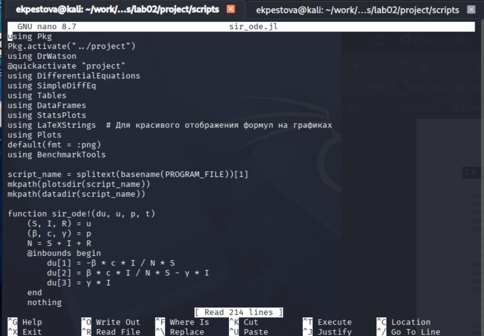
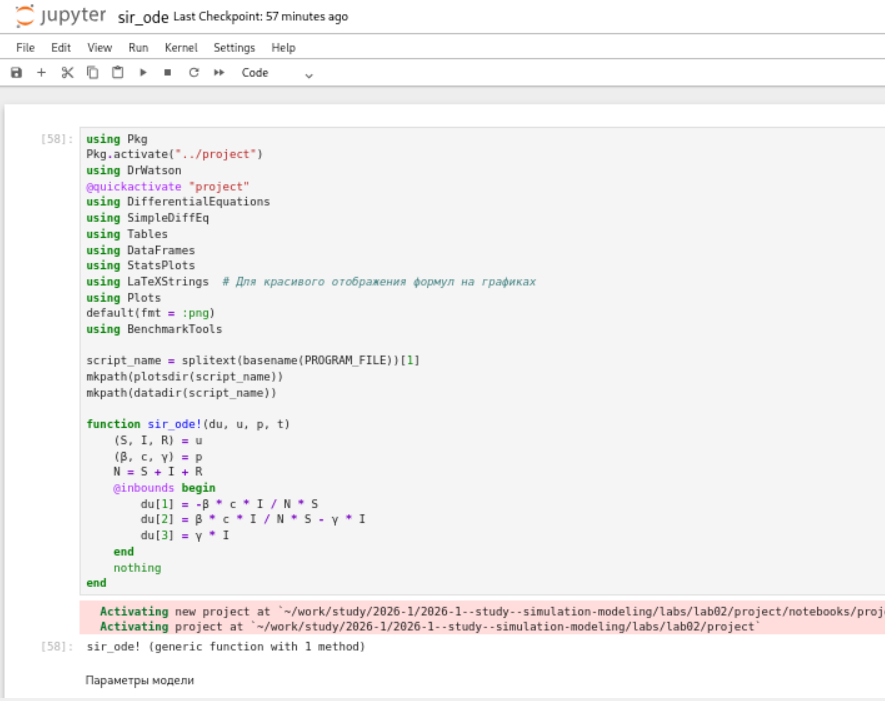
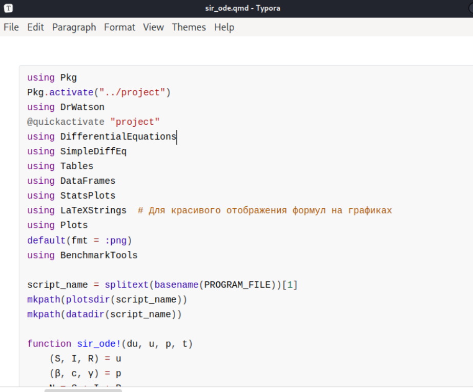
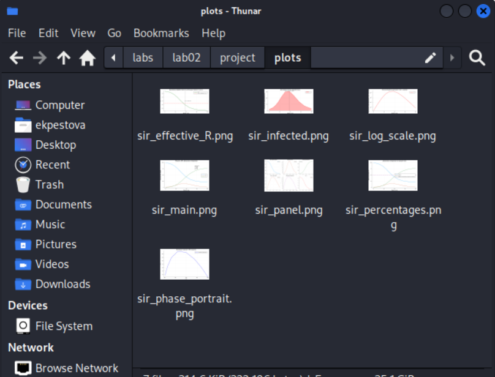
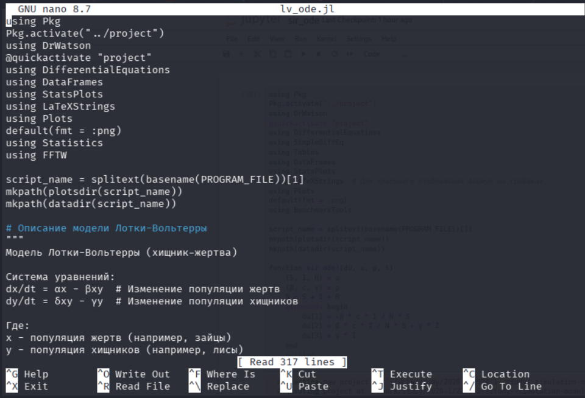
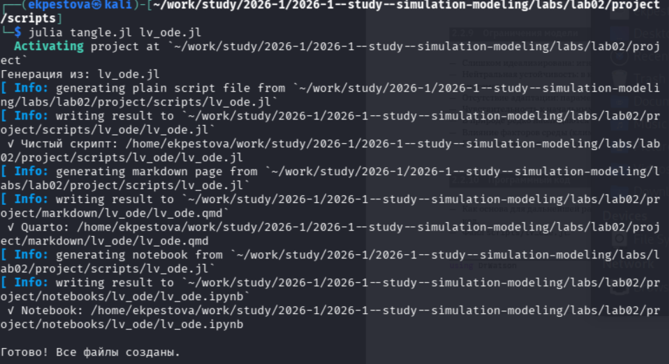
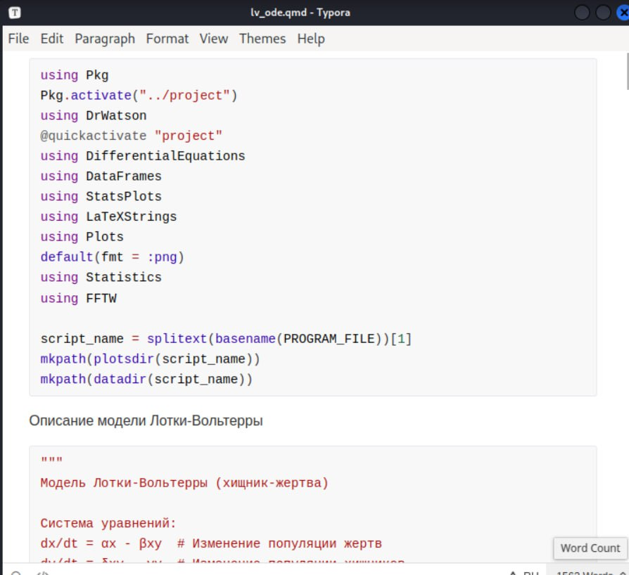
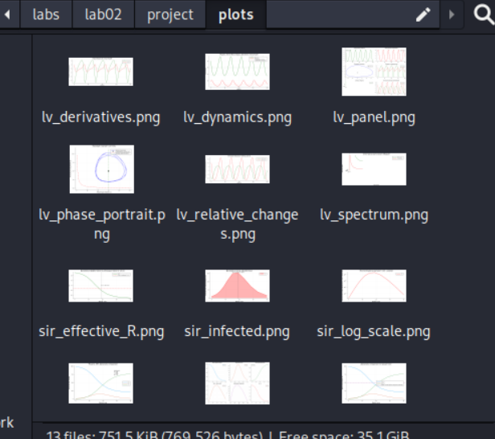
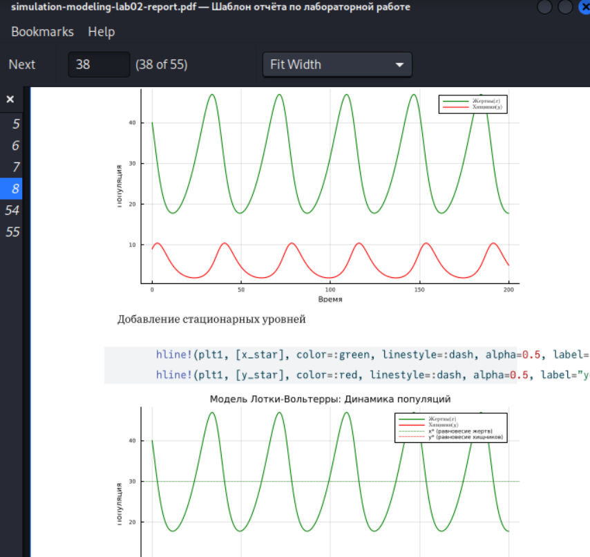

---
## Author
author:
  name: Пестова Ева Константиновна
  email: 1132236053@rudn.ru
  affiliation:
    - name: Российский университет дружбы народов
      country: Российская Федерация
      postal-code: 117198
      city: Москва
      address: ул. Миклухо-Маклая, д. 6

## Title
title: "Лабораторная работа №2"
subtitle: "Имитационное моделирование"
license: "CC BY"
date: 2026-03-02
date-format: "YYYY-MM-DD"
---

## Цель работы

Целью лабораторной работы №2 является -  изучение основных моделей  SIR и Лотки–Вольтерры, а так же изучение аспектов их программной реализации.

## Подготовка рабочего пространства

Я буду использовать скрипты из предыдущей лабораторной работы для выполнения первых пунктов задания, поэтому просто проверим корректность установки необходимых пакетов с помощью скрипта scripts/test_setup.jl ([рис. @fig-001]).

{#fig-001 width=70%}

## Модель SIR

Первым делом создаю файл scripts/sir_ode.jl с реализацией модели ([рис. @fig-002]).

{#fig-002 width=70%}

## Модель SIR

Далее создаю производные форматы ([рис. @fig-003]).

{#fig-003 width=70%}

## Модель SIR

Откроем и просмотрим jupyter-notebook, также запустим все ячейки ([рис. @fig-004]).

{#fig-004 width=70%}

## Модель SIR

Далее просмотрим файл .qmd ([рис. @fig-005]).

{#fig-005 width=70%}

## Модель SIR

Следующим шагом убедимся в том, что в  каталоге plots появились графики ([рис. @fig-006]).

{#fig-006 width=70%}

## Модель Лотки–Вольтерры

По той же схеме создаём файл scripts/lv_ode.jl с реализацией модели ([рис. @fig-007]).

{#fig-007 width=70%}

## Модель Лотки–Вольтерры

Также создаю производные форматы ([рис. @fig-008]).

{#fig-008 width=70%}

## Модель Лотки–Вольтерры

Запустим все ячейки в jupyter-notebook, соответственно, открыв его ([рис. @fig-009]).

{#fig-009 width=70%}

## Модель Лотки–Вольтерры

Просмотрим файл .qmd ([рис. @fig-010]).

{#fig-010 width=70%}

## Модель Лотки–Вольтерры

И наконец убедимся в наличии графиков в каталоге ([рис. @fig-011]).

{#fig-011 width=70%}

## Описание программы в отчете

В отчете после основоного описания лабораторной работы подключаю файл описания программы ([рис. @fig-012]).

{#fig-012 width=70%}

## Описание программы в отчете

Убедимся, что все корректно отображается ([рис. @fig-013]).

{#fig-013 width=70%}

## Выводы

В ходе данной лабораторной работы мной были изучены основные модели SIR и Лотки–Вольтерры и их программная реализация.

