---
## Author
author:
  name: Пестова Ева Константиновна
  email: 1132236053@rudn.ru
  affiliation:
    - name: Российский университет дружбы народов
      country: Российская Федерация
      postal-code: 117198
      city: Москва
      address: ул. Миклухо-Маклая, д. 6
## Title
title: Лабораторная работа №3
subtitle: Имитационное моделирование
license: CC BY
date: 2026-03-20
date-format: "YYYY-MM-DD"
---

## Цель работы

Ознакомление с моделью DaisyWorld и визуальная реализация модели с маргаритками с помощью Agents.jl.

## Реализация на Agents.jl

Создадим файл daisyworld.jl. Определим тип агента и функции шага модели ([рис. @fig-001]).

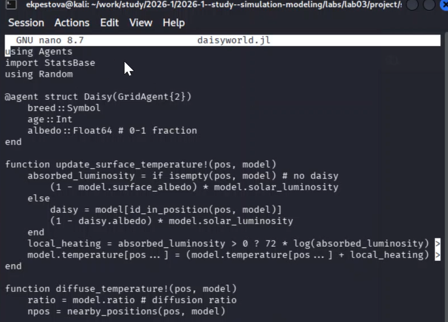{#fig-001 width=70%}

## Базовая визуализация

Сделаем базовую визуализацию, затем построим тепловую карту. Маргаритки будут отображаться черно-белыми в соответствии с их видом ([рис. @fig-002]).

{#fig-002 width=70%}

## Базовая визуализация

Запускаем скрипт ([рис. @fig-003]).

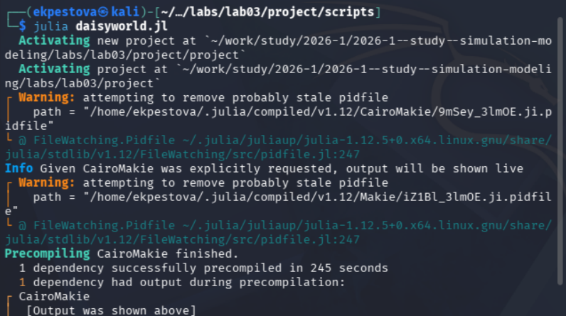{#fig-003 width=70%}

## Базовая визуализация

Просмотрим получившиеся изображения в  plots:

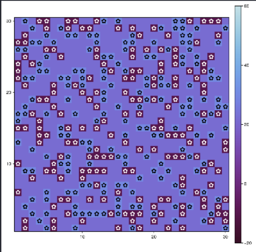{width=60%}

## Базовая визуализация

Создаем производные форматы с помощью  tangle.jl ([рис. @fig-005]).

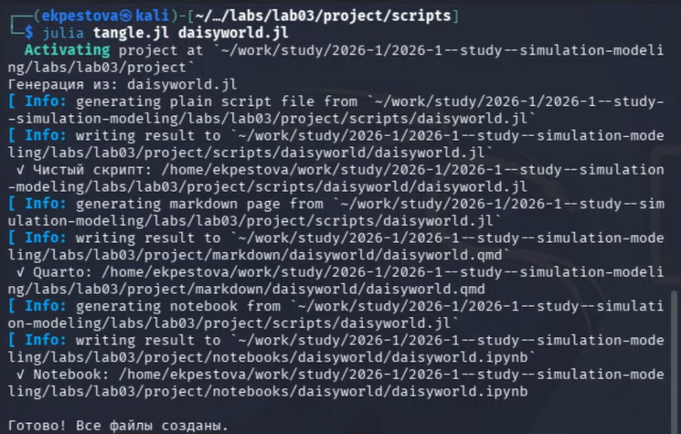{#fig-005 width=70%}

## Базовая визуализация

Запустим в jupyter-notebook ([рис. @fig-006]).

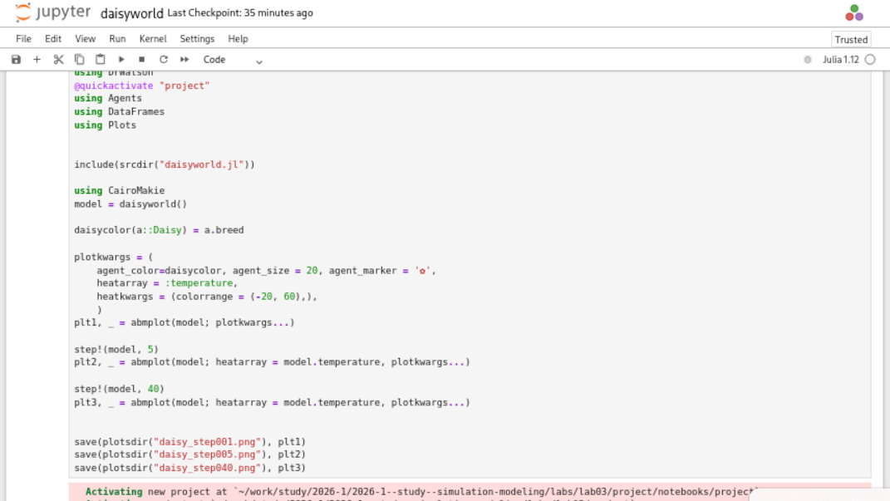{#fig-006 width=70%}

## Анимация модели

Создадим  видео эволюции модели ([рис. @fig-007]).

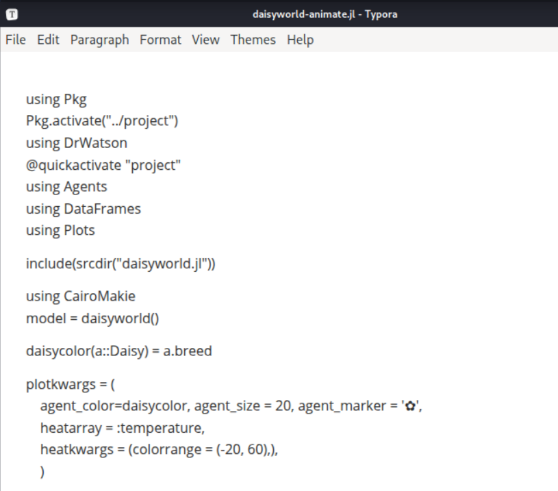{#fig-007 width=70%}

## Анимация модели

Запускаем скрипт ([рис. @fig-008]); ([рис. @fig-009])

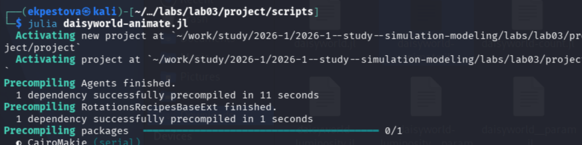{#fig-008 width=50%}  

{#fig-009 width=40%}

## Динамика числа маргариток

Построим график изменения числа маргариток в зависимости от модельного времени ([рис. @fig-010]).

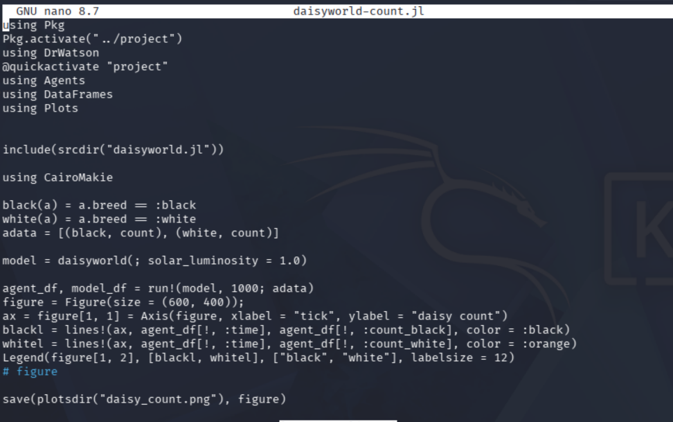{#fig-010 width=70%}

## Динамика числа маргариток

Запускаем скрипт ([рис. @fig-011]).

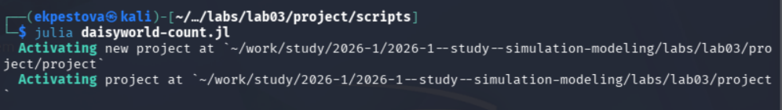{#fig-011 width=70%}

## Динамика числа маргариток

Создаем производные форматы с помощью  tangle.jl ([рис. @fig-012]).

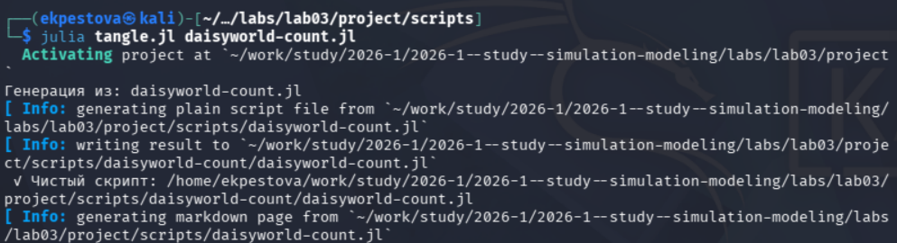{#fig-012 width=70%}

## Динамика числа маргариток

Запускаем в jupyter-notebook ([рис. @fig-013]).

{#fig-013 width=70%}

## Динамика числа маргариток

Просмотрим полученные изображения в plots:

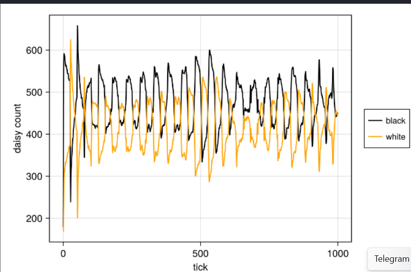{width=70%}

## Динамика модели

Построим  график изменения числа маргариток, температуры, альбедо в зависимости от модельного времени ([рис. @fig-014]).

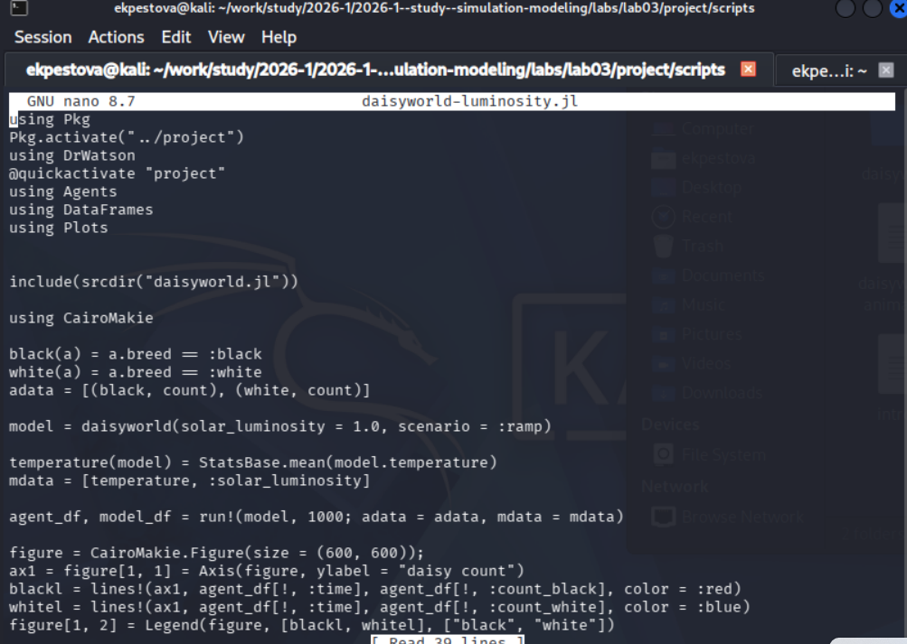{#fig-014 width=70%}

## Динамика модели

Запускаем скрипт ([рис. @fig-015]).

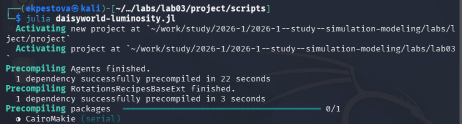{#fig-015 width=70%}

## Динамика модели

Создаем производные форматы с помощью  tangle.jl ([рис. @fig-016]).

{#fig-016 width=70%}

## Динамика модели

Запустим в jupyter-notebook ([рис. @fig-017]).

{#fig-017 width=70%}

## Динамика модели

Просмотрим полученные изображения в plots:

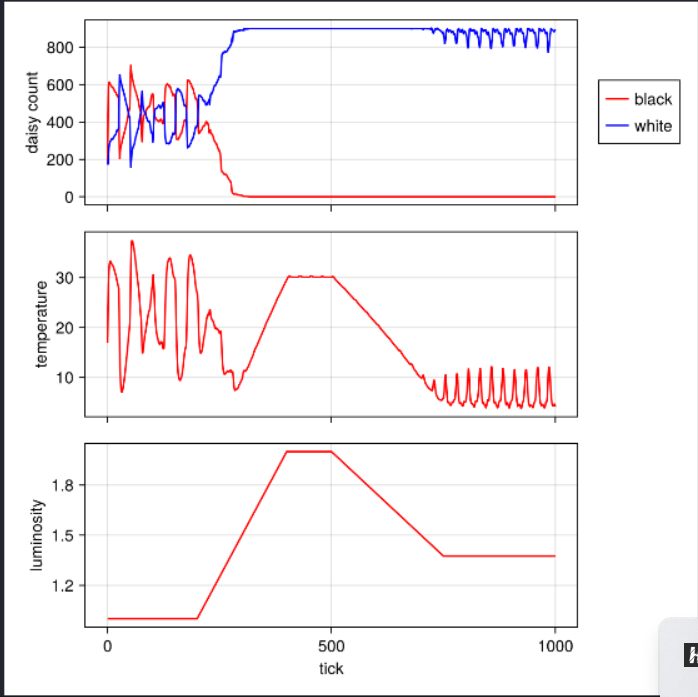{width=70%}

## Базовая визуализация (параметры)

Расширим базовую визуализацию за счёт параметров ([рис. @fig-018]).

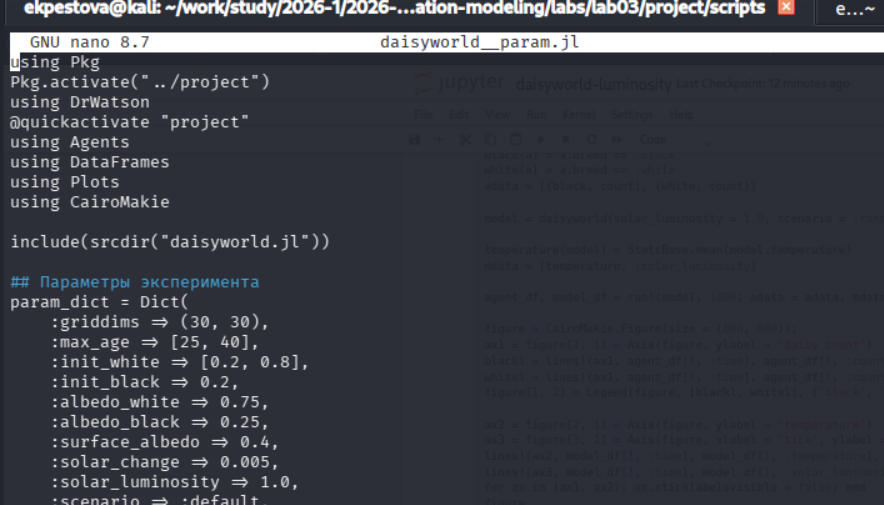{#fig-018 width=70%}

## Базовая визуализация (параметры)

Запускаем скрипт ([рис. @fig-019]).

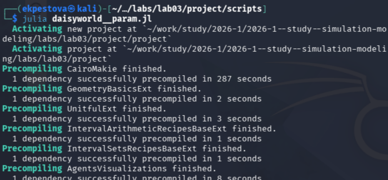{#fig-019 width=70%}

## Базовая визуализация (параметры)

Просмотрим полученные изображения в plots ([рис. @fig-020]).

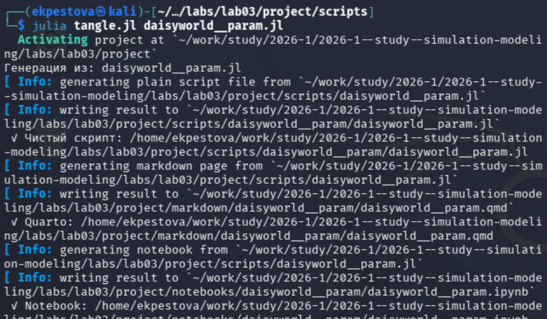{#fig-020 width=70%}

## Базовая визуализация (параметры)

Создаем производные форматы с помощью tangle.jl ([рис. @fig-021]).

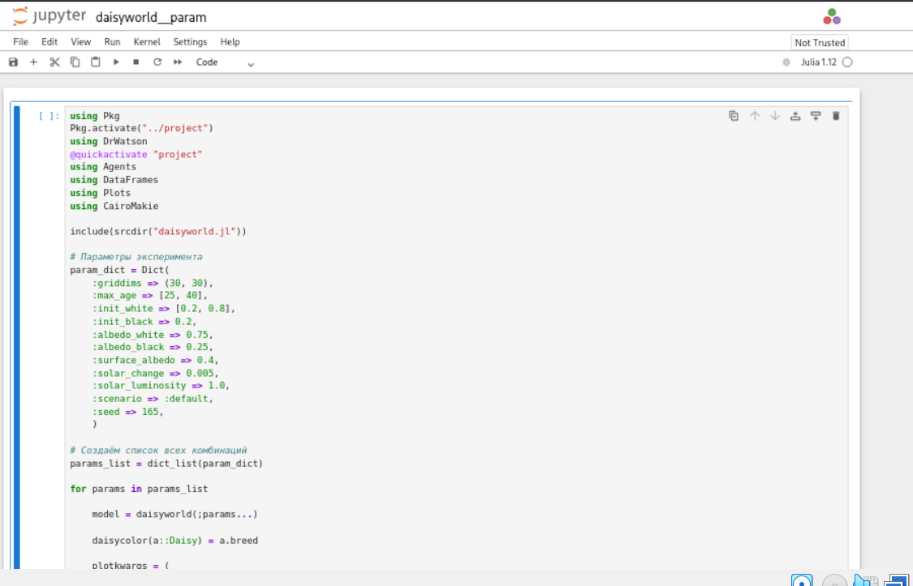{#fig-021 width=70%}

## Базовая визуализация (параметры)

Запустим в jupyter-notebook ([рис. @fig-022]).

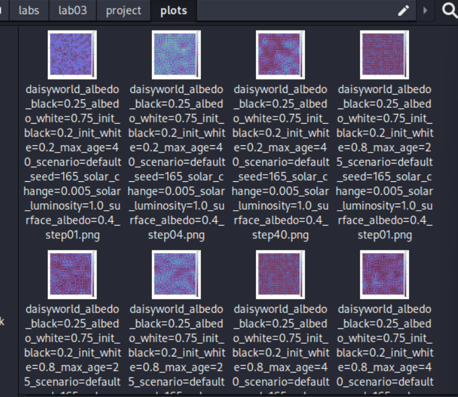{#fig-022 width=70%}

## Динамика модели (параметры)

Построим график изменения числа маргариток в зависимости от модельного времени с разными параметрами модели ([рис. @fig-023]).

{#fig-023 width=70%}

## Динамика модели (параметры)

Запускаем скрипт ([рис. @fig-024]).

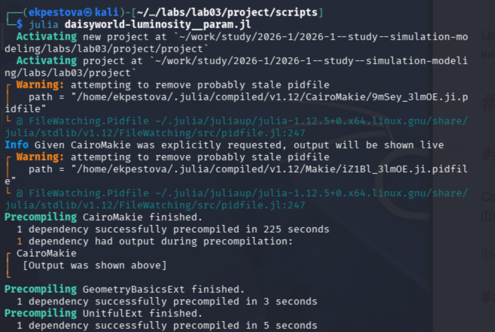{#fig-024 width=70%}

## Динамика модели (параметры)

Просмотрим полученные изображения в каталоге plots ([рис. @fig-025]).

{#fig-025 width=70%}

## Динамика модели (параметры)

Создаем производные форматы с помощью tangle.jl ([рис. @fig-026]).

{#fig-026 width=70%}

## Динамика модели (параметры)

Запустим в jupyter-notebook ([рис. @fig-027]).

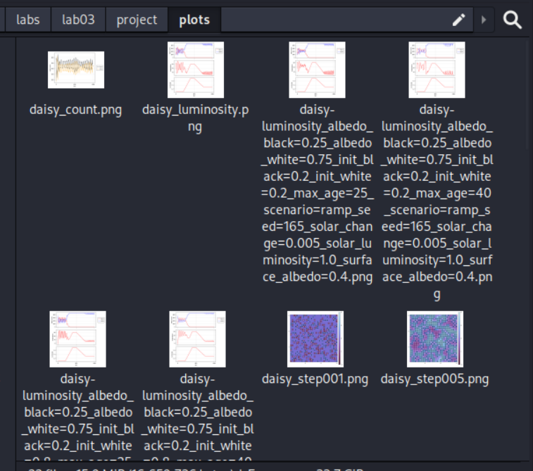{#fig-027 width=70%}

## Выводы

Во время лабораторной работы 3 была изучена модель DaisyWorld и визуально реализованы модели с маргаритками с помощью Agents.jl.

## Спасибо за внимание!