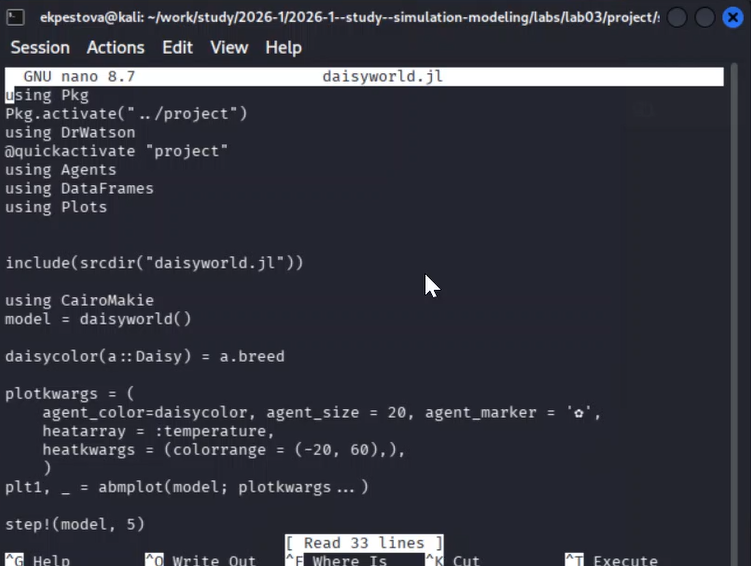
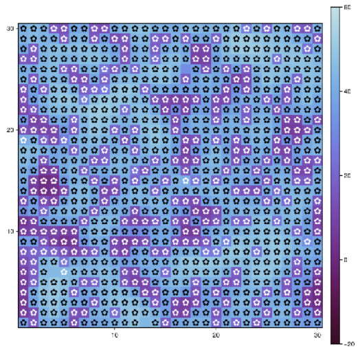
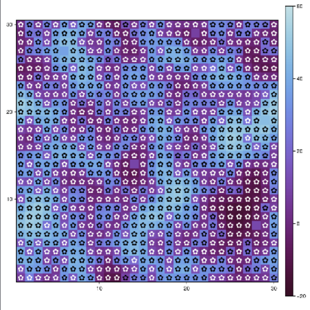
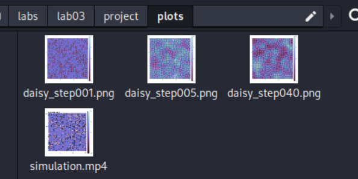
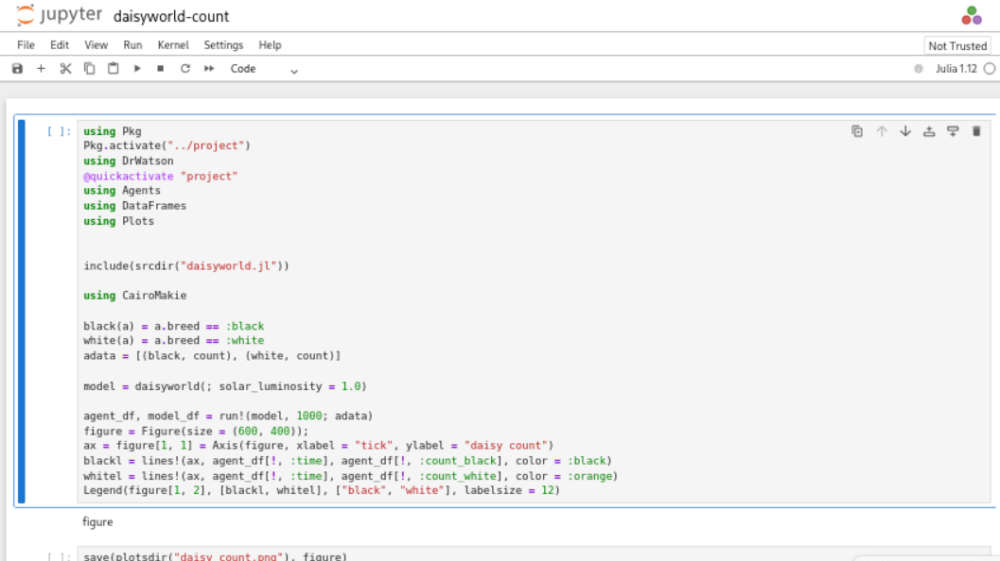
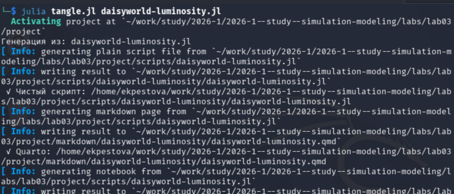
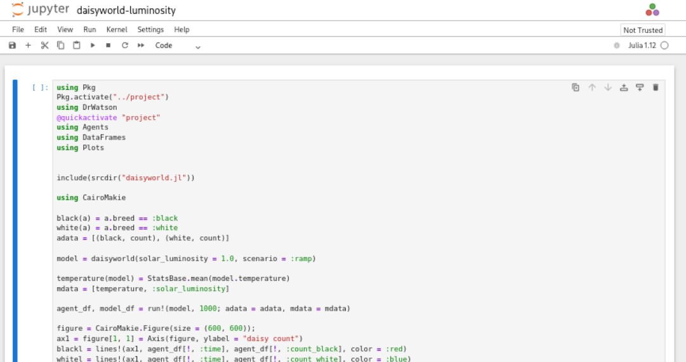
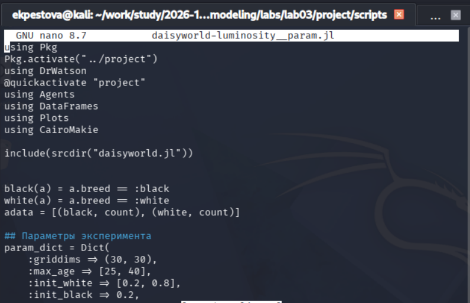
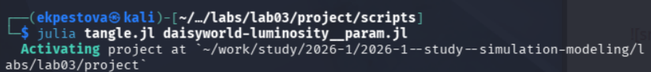
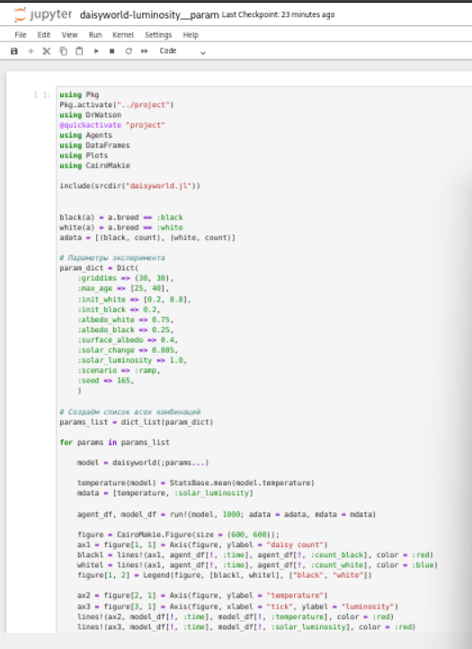

---
## Author
author:
  name: Пестова Ева Константиновна
  email: 1132236053@rudn.ru
  affiliation:
    - name: Российский университет дружбы народов
      country: Российская Федерация
      postal-code: 117198
      city: Москва
      address: ул. Миклухо-Маклая, д. 6

## Title
title: "Отчёт по лабораторной работе №3"
subtitle: "Имитационное моделирование"
license: "CC BY"
---

# Теоретическое введение

##  Агентный подход

Агентный подход к имитационному моделированию (Agent-Based Modeling, ABM) — это метод исследования сложных систем, в котором поведение системы возникает из взаимодействия множества автономных сущностей, называемых агентами. Вместо того чтобы описывать систему глобальными уравнениями, мы моделируем каждую индивидуальную единицу и правила её поведения, а затем наблюдаем, какие коллективные паттерны появляются снизу вверх. Этот подход особенно полезен, когда поведение системы трудно предсказать из-за нелинейностей, гетерогенности участников или адаптивных стратегий.

## Ключевые компоненты агентной модели

Любая агентная модель включает три основных элемента:

Агенты — это активные сущности. Они обладают:
Свойствами (атрибутами): возраст, цвет, запас ресурсов, координаты и т.п.
Правилами поведения: как агент реагирует на изменения среды и действия других агентов (например, перемещение, размножение, потребление).
Целями (не обязательно): в некоторых моделях агенты стремятся максимизировать свою выгоду или выжить.
Способностью к обучению или адаптации (в продвинутых моделях).
Среда — это пространство, в котором существуют агенты. Она может быть:
Дискретной (клеточная сетка, как в Daisyworld).
Непрерывной (двумерное или трёхмерное пространство).
Сетевой (граф социальных связей).
Абстрактной (например, рынок без явных координат).

Среда также может иметь свои свойства (температура, ресурсы) и динамику (диффузия, обновление).

Взаимодействия — правила, определяющие, как агенты влияют друг на друга и на среду. Они могут быть:
Локальными (только с соседями).
Глобальными (все агенты взаимодействуют со всеми).
Через среду (агенты изменяют среду, а среда влияет на агентов).

## Основные принципы агентного моделирования

Эмерджентность: глобальное поведение системы не закладывается явно, а возникает из локальных взаимодействий. Это позволяет открывать неожиданные закономерности.
Автономия: агенты действуют независимо, на основе своей внутренней логики.
Гетерогенность: агенты могут различаться по своим характеристикам и правилам, что отражает реальное разнообразие.
Локальность: чаще всего агенты обладают информацией только о своём ближайшем окружении.

## Модель Daisyworld

Модель Daisyworld, предложенная Джеймсом Лавлоком и Эндрю Уотсоном, иллюстрирует гипотезу Геи [2,3]. Гипотеза Геи рассматривает планету как единую, саморегулирующуюся систему, включающую как живые, так и неживые части.

В мире маргариток произрастают чёрные и белые маргаритки. Их альбедо различается: чёрные маргаритки поглощают свет и тепло, нагревая окружающую среду; белые маргаритки делают наоборот. Маргаритки могут размножаться только в определённом температурном диапазоне, а это значит, что слишком много (или слишком мало) тепла от солнца и/или окружающей среды в конечном итоге остановит их размножение.

Поверхность Геи нагревается солнцем, но растущие на ней маргаритки поглощают или отражают свет звёзд, изменяя локальную температуру.

Если температура становится слишком высокой или слишком низкой, маргаритки не захотят размножаться. Пока температура благоприятна, маргаритки конкурируют за землю и пытаются дать начало новому растению в местах, расположенных неподалёку от них.

Когда климат слишком холодный, черным маргариткам необходимо размножаться, чтобы повысить температуру, и наоборот — когда климат слишком теплый, необходимо производить больше белых маргариток, чтобы охладить климат.

Взаимодействие живых и неживых аспектов этого мира находит равновесие в широком диапазоне параметров, хотя при достаточно сильном внешнем воздействии маргаритки не смогут регулировать температуру планеты и в конечном итоге вымрут.

##  Описание модели Daisyworld

В модели Daisyworld агентами являются чёрные и белые маргаритки. Они живут на клеточной сетке (среда).

Свойства агентов: вид и возраст.

Правила:

Маргаритки изменяют локальную температуру за счёт разного альбедо.
Температура влияет на вероятность размножения (чем ближе к оптимуму, тем выше шанс заселить соседнюю пустую клетку).
Агенты стареют и умирают после определённого возраста.
Среда (температура) диффундирует между клетками.

# Задание

- Создать рабочий каталог для всего курса.
- Создать рабочее пространство для программ в рамках лабораторной работы.
- Выполнить все задания по тексту лабораторной работы.
- Установить необходимые пакеты.
- Выполнить предложенный код.
- Преобразовать код в литературный стиль.
- Сгенерировать из литературного кода:
	- чистый код;
	- jupyter notebook;
	- документацию в формате Quarto.
	- Выполнить код из jupyter notebook.
- Интегрировать документацию в формате Quarto в отчёт.
- Добавить в код в литературном стиле вычисление для набора параметров.
- Сгенерировать из литературного кода с параметрами:
	- чистый код;
	- jupyter notebook;
	- документацию в формате Quarto.
- Выполнить код из jupyter notebook с параметрами.
- Интегрировать документацию с параметрами в формате Quarto в отчёт.
- Результирующие файлы не удаляйте, выложите на git.

# Цель работы

Ознакомление с моделью DaisyWorld и визуальная реализация модели с маргаритками с помощью Agents.jl.

# Выполнение лабораторной работы

## Реализация на Agents.jl

Создадим файл daisyworld.jl. Определим тип агента и функции шага модели ([рис. @fig-001]).

{#fig-001 width=70%}

## Базовая визуализация

Сделаем базовую визуализацию, затем построим тепловую карту. Маргаритки будут отображаться черно-белыми в соответствии с их видом ([рис. @fig-002]).

{#fig-002 width=70%}



Запускаем скрипт ([рис. @fig-003]).

{#fig-003 width=70%}

Просмотрим получившиеся изображения в  plots:

{width=70%}

{width=70%}

{width=70%}

Создаем производные форматы с помощью  tangle.jl ([рис. @fig-005]).

{#fig-005 width=70%}

Запустим в jupyter-notebook ([рис. @fig-006]).

{#fig-006 width=70%}

## Анимация модели

Создадим  видео эволюции модели ([рис. @fig-007]).

{#fig-007 width=70%}

Запускаем скрипт ([рис. @fig-008]); ([рис. @fig-009])

{#fig-008 width=70%}  

{#fig-009 width=70%}

## Динамика числа маргариток

Построим график изменения числа маргариток в зависимости от модельного времени ([рис. @fig-010]).

{#fig-010 width=70%}



Запускаем скрипт ([рис. @fig-011]).

{#fig-011 width=70%}

Создаем производные форматы с помощью  tangle.jl ([рис. @fig-012]).

{#fig-012 width=70%}

Запускаем в jupyter-notebook ([рис. @fig-013]).

{#fig-013 width=70%}

Просмотрим полученные изображения в plots:

{width=70%}

## Динамика модели

Построим  график изменения числа маргариток, температуры, альбедо в зависимости от модельного времени ([рис. @fig-014]).

{#fig-014 width=70%}



Запускаем скрипт ([рис. @fig-015]).

{#fig-015 width=70%}

Создаем производные форматы с помощью  tangle.jl ([рис. @fig-016]).

{#fig-016 width=70%}

Запустим в jupyter-notebook ([рис. @fig-017]).

{#fig-017 width=70%}

Просмотрим полученные изображения в plots:

{width=70%}

## Базовая визуализация (параметры)

Расширим базовую визуализацию за счёт параметров ([рис. @fig-018]).

{#fig-018 width=70%}



Запускаем скрипт ([рис. @fig-019]).

{#fig-019 width=70%}

Просмотрим полученные изображения в plots ([рис. @fig-020]).

{#fig-020 width=70%}

Создаем производные форматы с помощью tangle.jl ([рис. @fig-021]).

{#fig-021 width=70%}

Запустим в jupyter-notebook ([рис. @fig-022]).

{#fig-022 width=70%}

## Динамика модели (параметры)

Построим график изменения числа маргариток в зависимости от модельного времени с разными параметрами модели ([рис. @fig-023]).

{#fig-023 width=70%}



Запускаем скрипт ([рис. @fig-024]).

{#fig-024 width=70%}

Просмотрим полученные изображения в каталоге plots ([рис. @fig-025]).

{#fig-025 width=70%}

Создаем производные форматы с помощью tangle.jl ([рис. @fig-026]).

{#fig-026 width=70%}

Запустим в jupyter-notebook ([рис. @fig-027]).

{#fig-027 width=70%}

# Выводы

Во время лабораторной работы 3 была изучена модель DaisyWorld и визуально реализованы модели с маргаритками с помощью Agents.jl.

# Список литературы

1. Datseris G., Vahdati A.R., DuBois T.C. Agents.jl: a performant and feature-full agent-based modeling software of minimal code complexity // SIMULATION. SAGE Publications, 2022. С. 003754972110688.

2. Watson A.J., Lovelock J.E. Biological homeostasis of the global environment: the parable of Daisyworld // Tellus B: Chemical and Physical Meteorology. Stockholm University Press, 1983. Т. 35, № 4. С. 284.

3. Wood A.J. и др. Daisyworld: A review // Reviews of Geophysics. American Geophysical Union (AGU), 2008. Т. 46, № 1.
